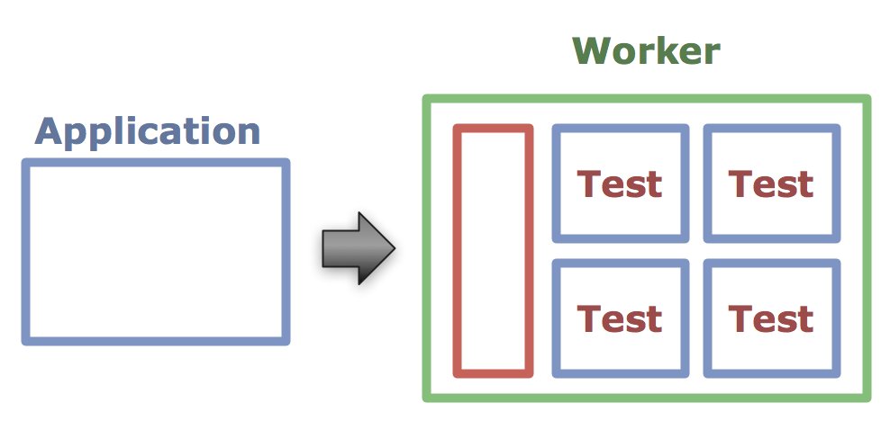

!SLIDE
# How?

!SLIDE bullets center architecture

!SLIDE bullets
# The Worker

!SLIDE workers center

!SLIDE workers center

!SLIDE workers center

!SLIDE workers center

!SLIDE bullets
# The Build
* Setup
* Install
* Runs Tests

!SLIDE bullets
# A Ruby Build
* export CI=true
* git clone && checkout
* rvm use 1.9.2
* bundle install
* bundle exec rake

