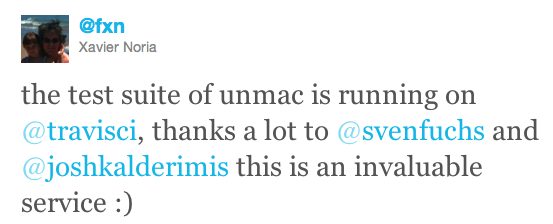
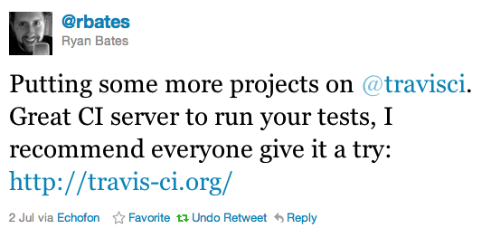
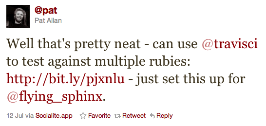
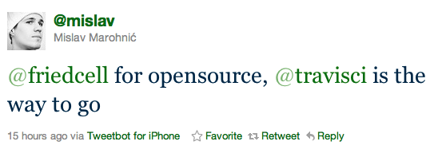

!SLIDE
# Now

!SLIDE bullets
# Facts!
* 440 Repositories
* 7,500 Commits
* 30,000 Builds

!SLIDE bullets strike-through
# Facts!
* 440 Repositories
* 7,500 Commits
* 30,000 Builds

!SLIDE bullets
# Facts!
* 570 Repositories
* 9,700 Commits
* 40,000 Builds

!SLIDE bullets strike-through
# Facts!
* 570 Repositories
* 9,700 Commits
* 40,000 Builds

!SLIDE bullets
# Facts!
* 625 Repositories
* 11,000 Commits
* 45,000 Builds

!SLIDE bullets
# Users?
* RSpec, Cucumber, Devise, Mocha, ...

!SLIDE bullets
# Who else?
* Compass, Sprockets, OmniAuth, Mongoid, ...

!SLIDE bullets
# Wow!
* Json, Webmock, CanCan, Whenever, ...

!SLIDE bullets
# Amazing!
* Guard, Oauth2, Yard, SimpleCov, ...

!SLIDE bullets gosh
# GOSH
* github-services bundler slimgems railscasts diaspora couch_potato active_admin
* simple_form ruby-on-rails-tmbundle liquid execjs jenkins.rb nifty-generators active_merchant
* grape request-log-analyzer refinerycms koala linguist htty vcr nested_form oauth2 savon ruby-warrior
* communityengine i18n uglifier engineyard multi_json phony octokit pusher-gem parslet split globalize3
* cloudist squeel russian themes_for_rails whois make_resourceful routing-filter girl_friday tire
* rack-protection boom blather linkedin fabrication money curb restfulie chunky_png slop
* faraday ripple serve celluloid stamp broadcast forem mongoid-tree tabtab

!SLIDE bullets
# And ...
* that's just the beginning.

!SLIDE bullets love
# LOVE
* Github, Rails, Rubinius, ...
* Tons of free boxes!
* Great sponsors!

!SLIDE bullets center tweets

!SLIDE bullets center tweets

!SLIDE bullets center tweets

!SLIDE bullets center tweets

!SLIDE bullets center tweets

!SLIDE bullets center tweets

!SLIDE bullets center tweets

!SLIDE bullets sponsors
# Sponsors
* 
  
  

!SLIDE bullets team
# Team
* 
  
  
  
  
  
  
* @cesariogw, @dmathieu, @ifesdjeen
* @michaelklishin, @\_beai, @charperuk, @fritzek
